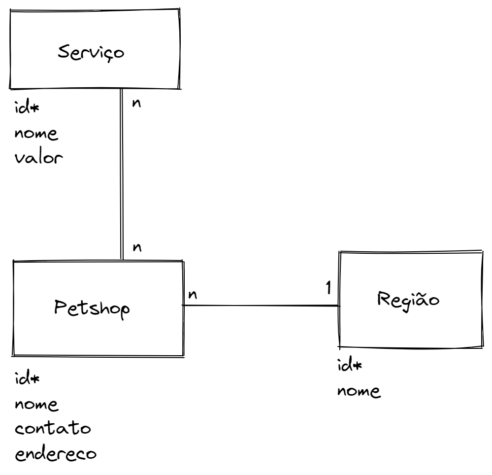

# Desafio Chefão - iPet - Banco de dados

Foi criada uma tabela principal `petshop`, relacionada com uma tabela
`regiao` e uma tabela `servico`, através de uma tabela intermediária
`servico_petshop`.

## Tabelas

*Colunas com * são chaves primárias.

### petshop

| Coluna    |  Tipo    | Descrição                |
|-----------|----------|--------------------------|
| id*       | integer  | Identificador do petshop |
| nome      | varchar  | Nome                     |
| contato   | varchar  | Número de telefone       |
| endereco  | varchar  | Endereço completo        |
| regiao_id | integer  | Identificador da região  |

### regiao

| Coluna    | Tipo     | Descrição                |
|-----------|----------|--------------------------|
| id*       | integer  | Identificador da região  |
| nome      | varchar  | Nome da região           |

### servico

| Coluna    | Tipo     | Descrição                |
|-----------|----------|--------------------------|
| id*       | integer  | Identificador do serviço |
| nome      | varchar  | Nome do serviço          |
| valor     | float    | Valor                    |

### servico_petshop

Tabela intermediária do relacionamento n-n entre `servico` e 
`petshop`.

| Coluna     | Tipo     | Descrição                |
|------------|----------|--------------------------|
| servico_id | integer  | Identificador do serviço |
| petshot_id | integer  | Identificador do petshop |

## Diagrama de Entidade e Relacionamento

Observação: Não é necessário representar a tabela intermediária no diagrama.